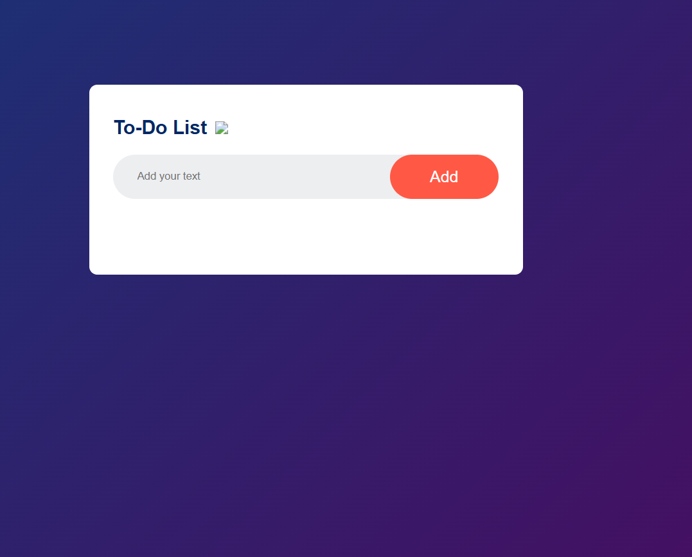
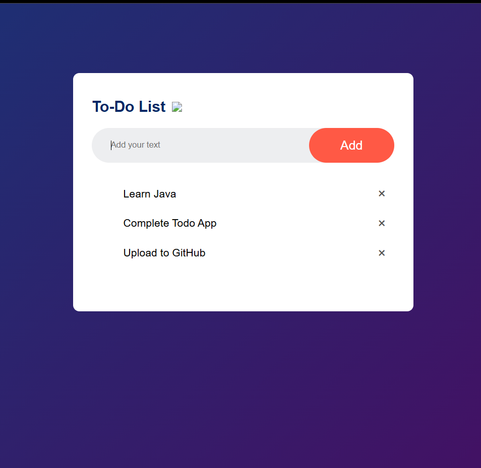

# Todo List App

A simple Todo List application built using HTML, CSS and JavaScript.

## Features
- Add new tasks
- Delete tasks
- Mark tasks as completed
- Simple and clean UI

## Technologies Used
- HTML
- CSS
- JavaScript

## Live Demo
https://shubham-code05.github.io/todo-list-app/

## Screenshots

### Home Page

### Task Added

